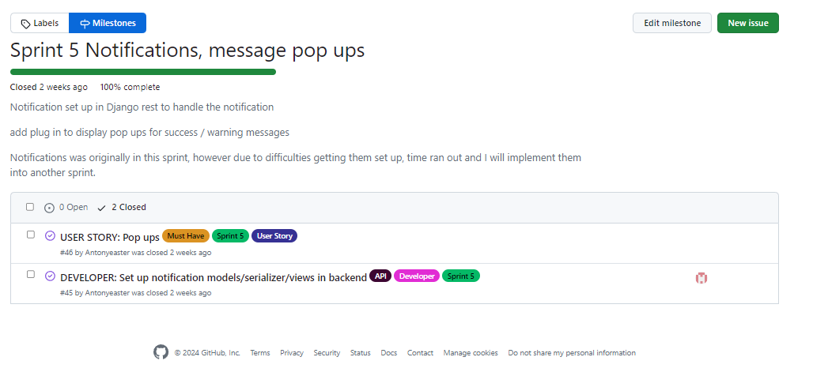

# Agile Methodologies

* **Agile Methodologies**
  * [Overview](#overview)
  * [Sprint Notes](#sprint-notes)
    * [Sprint 1](#sprint-1)
    * [Sprint 2](#sprint-2)
    * [Sprint 3](#sprint-3)
    * [Sprint 4](#sprint-4)
    * [Sprint 5](#sprint-5)
    * [Sprint 6](#sprint-6)
    * [Sprint 7](#sprint-7)
  * [Milestones](#milestones)
  * [Project Board](#project-board)
  * [Labels](#labels)

## **Overview**

This was my second time using Agile to plan my project. After finding it very helpful the first time, I'm glad to say it's done just as well this time. I find the process of working on one task at a time very helpful for staying on track. That's not to say I didn't get lost a few times, but as the issues and milestones were there, all I had to do was go over them to get back on track. I recorded my sprint notes during the process and have documented them below. 

### *Sprint 1*

The first sprint was all about getting everything set up and a very basic authentication working. This sprint was set to be finished before my next mentor meeting on the 20th February.

During this sprint, the first task was to get a profiles model up and running with authentication. The next task was to get all my models in place with CRUD functionality only on the "Post model". This was all done on my brick connect api backend workspace. Once both these tasks were completed, the first deployment was done to Heroku, which is where I encountered my first issue. When the deployment was complete and the build was successful, the app would display a "Deployment application error" without any real explanation why. I solved the issue by trolling through the Heroku logs and eventually noticing something was wrong within my "Procfile". After altering a typo within the Procfile, the app ran straight away. This bug was created by myself while using the Code Institute deployment instructions for Django Rest Framework.

Next was to start building the front end with ReactJS. The task was to build a completely basic sign up and sign in forms to confirm authentication was working and communication was working between front end and back end. 

I can confirm all tasks within this sprint are completed and before the schedule date. I finished 2 days ahead of schedule on the 18th February.

### *Sprint 2*

In this sprint the main goal was to get posts rendering with CRUD functionality. I gave myself a week to make these changes.

The first task was get a post form added with the ability to add a title, description and image. Once the post is created, I opted to list my posts and use infinite scroll to keep the user scrolling. I also created a post page which is entered by clicking the post. Once on the post page I added the functionality to delete the post or edit the post if authenticated. This concludes the CRUD functionality with create, read, update and delete.

I added extra options to my navigation, being feed, liked, and favourited. This is the point I ran into problems with my liked page and feed page were all showing the same posts in the same order. After making adjustments to my posts in the backend API, I was able to use Django filters to fix this issue. The favourited and feed nav link will be wired up in a different sprint. 

I also added the option for a user to log out and see that they are logged in by seeing their profile image. The profile is yet to be wired up and will be completed in a future sprint.

After reviewing my issues and milestones, I realised I had missed a few issues that had already been completed during the stages of Sprint 2. These were added late but were completed within the time frame I had allocated for myself. It's a slight oversight on my part and part of the learning curve, one that I'll be sure to make note of.

All tasks were completed ahead of schedule with a day to spare.

### *Sprint 3*

Sprint 3 was a big section of my project and pushed me to the wire in terms of schedule.

The first thing to do was to get all my comments set up and displayed below the posts with full CRUD (create, read, update, delete) functionality. I also implemented the infinate scroll feature along with a timestamp for other users to see when the comment was made.

I then moved onto my profile section by first getting my most popular profiles set up with a different approach depending on whether the user is on mobile or desktop. This is controlled by the number of followers the user has, and the user with the most will be displayed at the top. Implementing the follow feature was done first on the popular profiles, then the unfollow feature, giving the user the ability to follow or unfollow a user without having to enter their profile. I also added the avatar image to the popular profiles as a smaller version of the one on the profile page.

Getting the basic page set up was next, this was just pulling in all this information on the user that was signed in and displaying a card to hold it, along with the follow button if they are not already being followed by that user. This will need additional styling in a future sprint. Below the card for the user profile, I added the user's posts. Once I made the profile view, I moved on to giving the user the functionality to edit their profile. This involves username updates, password updates, profile image updates, and bio updates.

Adding the favourite functionality was the next task. The user can favourite a post and then have all their favourite posts in a list on a separate page. Alternately, they can remove their favourite, and this removes it from the favourited page.

All tasks were just finished in time on the deadline day.

### *Sprint 4*

Sprint 4 was about giving the user more ways to look for posts and interact with comments.

The first part of the sprint was creating my categories. I decided to hard code the categories into the post model as there are only 2 and they are unlikely to change.
I encountered one bug within the dropdown bootstarp code. As with my other links, I used a NavLink to access my categories; however, I encountered a warning regarding nesting a link within a link. To fix this, I used the "as" prop within my dropdown element, NavLinking it to my path for the separate categories.

Next, I moved onto the defensive design. I used modals to prompt the user when signing out and deleting. This went very smoothly with no problems.

Next, I created the commentlike serializers and views and linked them into my React frontend. I encountered issues where I had made a mistake with the props, I had entered in very slightly different names to the fields I had set in my serializers. This was causing a "NaN" error (not a number). Once I corrected my mistake, the code worked correctly.

Lastly, I had originally decided to create a popular posts section; however, as of sprint 4, I have decided to remove that as a potential "won't have". This is due to timescales and a personal desire to not clog up the UI unnecessarly.

Sprint 4 finished a day ahead of schedule.

### *Sprint 5*

In Sprint 5, I wanted to get my notifications set up along with pop-up messages.

I started with the notifications in the backend and got my models, serializers, signals and views set up. I was able to get my notification generated manually through my Django API admin panel. However, I wanted to use signals to trigger notifications automatically when someone does something. I spent a lot of time on this without success, so I decided to take a break from notifications and move onto pop-ups.

Pop-ups went relatively smoothly once I found the correct import. I then coded into all interactive functions a toast to let the user know something had just happened or if there was an error.

I returned to the notifications but unfortunately ran out of time on this sprint to finish it.

I closed the sprint and moved notifications back into the list of user stories.

### *Sprint 6*

Sprint 6 was originally going to be all about styling. However, due to the problems I had in the last sprint, I had to add notifications too. I started with notifications and after a lot of changing things around and learning different ways to debug, it was a simple error and one I would think will stick around with me for a long time. I'd missed an 's' of the word notification.  Once I'd learned how to adjust the debug settings the error was much more readable.

After notifications, I got straight into adding style to the page using CSS modules and React Bootstrap.

I finished this sprint on time and ready for the final sprint.

### *Sprint 7*

Sprint 7 was the final sprint for this project. This sprint was all about the remaining developer jobs, testing and documenting. This sprint went smoothly without any problems.

Adding the documentation is just time consuming. However, seeing it all come together makes it all worth it.

This sprint was completed on the date I had set for myself.

## **Milestones**

For this project I completed seven Milestones. They were all vital to the development of this project. 

### Sprint 1 - Basic set up

### Sprint 2 Authentication and Post functionality

### Sprint 3 Comments, Followers, Profile Page, Favourites

### Sprint 4 Categories, like Comment, Popular posts, Defensive design

### Sprint 5 Notifications, message pop ups

### Sprint 6 Styling - Notifications

### Sprint 7 Developer Testing and Documentation

## Project Board

You can view my Project board [here](https://github.com/users/Antonyeaster/projects/8)

## Labels

I separated my issues into multiple labels but the most important ones are documented below:

### Must Have

### Could Have

### Should Have

### Won't Have

Back to [README](README.md)
