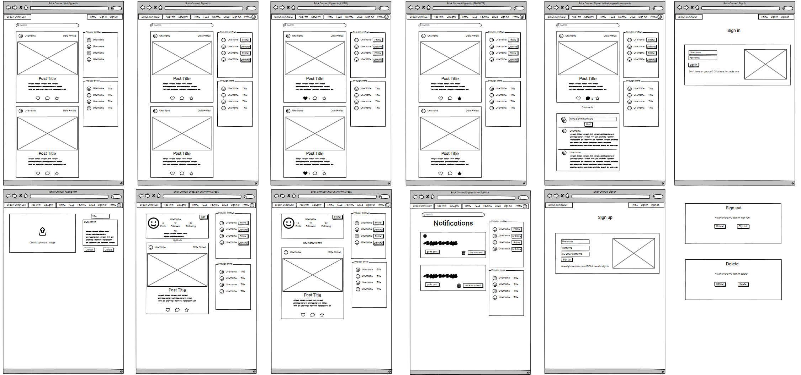
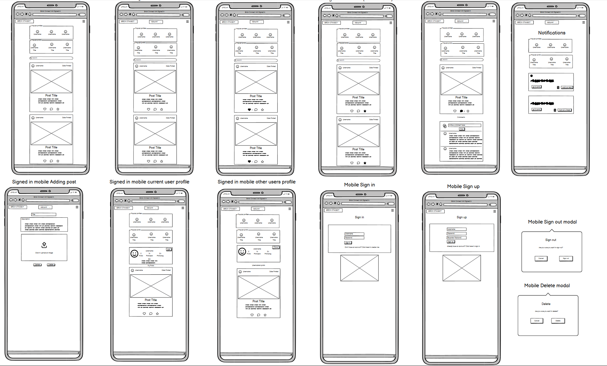

# Brick Connect
## **Site Overview**

Brick Connect is an online community designed with React.js, tailored specifically for LEGO enthusiasts. It serves as a platform where users can engage with each other, share their LEGO creations, insights, and ideas.

Users have the ability to create posts showcasing their LEGO builds and share them with the community. They can also interact with posts by liking them or adding them to their favorites for later reference. Additionally, users can engage in discussions by commenting on posts, allowing for feedback, questions, and conversations within the community.

Brick Connect also provides users with control over their contributions. Post owners can edit or delete their posts as needed, ensuring they maintain ownership and autonomy over their content.

To keep users informed and engaged, Brick Connect includes a notification system. Users receive notifications for comments left on their posts, as well as notifications when others follow them. This feature enhances user interaction and helps maintain a sense of community within Brick Connect.

Overall, Brick Connect offers a welcoming and collaborative environment where LEGO enthusiasts can come together, share their passion, and enjoy the world of LEGO building.

Brick Connect serves as a front-end component which is connected to the [Brick Connect API backend](https://github.com/Antonyeaster/brick-connect-api), developed using Django Rest Framework.

## Table of contents:
1. [**Site Overview**](#site-overview)
1. [**Planning stage**](#planning-stage)
    * [**Strategy**](#strategy)
      * [***Site Aims***](#site-aims)
      * [***Target Audiences***](#target-audiences)
      * [***User Stories***](#user-stories)
    * [***Wireframes***](#wireframes)
    * [***Database Schema***](#database-schema)
    * [***Colour Scheme***](#color-scheme)
    * [***Typography***](#typography)
1. [**Agile Development**](#agile-development)
1. [**Features**](#features)
    * [***Navbar***](#navbar)
      * [***Sign Up***](#sign-up)
      * [***Sign In***](#sign-in)
      * [***Sign Out***](#sign-out)
    * [***Posts Pages***](#home-page)
    * [***Post Detail***](#post-detail-page)
    * [***Profile Pages***](#Profile-page)
    * [***Toasts***](#toasts-messages)
    * [***Defensive Design***](#defensive-design)
    * [***User Authentication***](#user-authentication)
    * [***404 Page***](#404-page)
1. [**Future-Enhancements**](#future-enhancements)
1. [**Testing Phase**](#testing-phase)
1. [**Deployment**](#deployment)
1. [**Software and Tech**](#software-and-tech)
1. [**Media**](#media)
1. [**Credits**](#credits)
1. [**Honourable mentions**](#honorable-mentions)

## Planning Stage

### **Site Aims:**
* Create an interactive Lego community where users can engage with others and gain inspiration.
* Have a simple, intuitive sign up and sign in section for all users to gain full access.
* Have easy to follow navigation for both mobile and desktop devices.
* Provide CRUD (create, read, update, delete) functionality for posts.
* To give the users different sections for their liked posts and favourited posts.
* Have a search bar enabling the user to search for posts or other users.
* Have profile information for the user to fill out an optional bio about themselves.
* Connect seamlessly with the Brick Connect API back end.
* Give registered users full access to the site, enabling them to create posts, comment on posts, like posts, like comments, favourite posts, and edit all previously listed.
* Giving all users the chance to gain inspiration by being able to view all posts even when unregistered

### **Target Audiences:**
* Lego enthusiasts looking for other Lego enthusiasts
* People wanting to track their Lego journey
* People looking to get into Lego but need inspiration
* People looking for ideas for their next build
* People are just generally interested in Lego.
* Lego creators wanting to share their ideas with others

### **User Stories:**

#### **Site User**
As a **Registered** user I can: 
* Sign in to the site so that I can gain full access to the site
* See if I'm logged in or not so that log in if needed
* View the navbar from all pages so that I can navigate between pages easily
* Navigate through pages quickly and efficiently so that I can view the site content without page refresh
* Maintain my logged in status until I choose to log out so that my user experience is not compromised
* View other users avatar so that I can easily identify that particular profile user
* Create posts so that I can share my images with the rest of the community
* Delete my posts so that remove any posts I don't want to display
* View the post detail so that I can learn more about the post
* Like or remove my like from a post so that I can express my liking of the post or remove the like if I choose to do so
* View the most recent posts ordered by created first from top to bottom so that I can quickly be up to date with all the new posts
* Search for post with keywords or by username so that I can find posts and user profiles I am most interested in
* View posts I've liked so that I can share them with other or just revisit them
* View my favourite posts so that I can separate my general liked posts from my favourites
* Keep scrolling through the posts so that I don't have to keep pressing next page
* Keep scrolling through comments so that I don't have to keep going to the next page
* Click on the posts to view the post page so that I can read the comments about the post
* Edit my post title, description and change the image so that my post can be corrected or updated after it was posted
* Create a comment on a post so that I can share my thoughts about the post
* See how long ago the comments were posted so that I know how long ago the comment was made
* Read all comments on a post so that I can see what other people this of the post
* Delete my comment so that I have removal control over my comments
* Edit the comment so that I can fix or update the comment
* Like a comment so that I can express myself without having to make a comment
* View other profile pages so that I can see information about their posts
* View a list of the most followed profiles so that I can see which profiles are the most popular
* Follow and unfollow so that I can control the specific posts within my feed
* Edit my profile so that I can update my information
* Update my username and password so that update my display name and keep my profile secure
* Sign out of my profile so that I can keep my profile secure
* Favourite a post so that I can come back to them for inspiration
* Receive notifications so that I can get updated when someone follows my profile or has made comment on my post
* Click on delete/sign out and get a pop up so that I can confirm I defiantly want to do these things
* Categorise my post so that other users can fin my posts easier
* See a pop up so that I know I have done something successfully or there was a problem
* Like a comment so that I can express myself without having to make a comment

As an **Unregistered** User I can:
(Some user stories relate to both registered and unregisted, this is why they are duplicated for each section)

* Create a new account so that I can access the full sights features
* View the post detail so that I can learn more about the post
* View the most recent posts ordered by created first from top to bottom so that I can quickly be up to date with all the new posts
* Search for post with keywords or by username so that I can find posts and user profiles I am most interested in
* Click on the posts to view the post page so that I can read the comments about the post
* View other profile pages so that I can see information about their posts
* View a list of the most followed profiles so that I can see which profiles are the most popular 

### **Wireframes**

To give myself a guideline for the project I created wireframes for desktop and mobile.

### Desktop wireframes

### Mobile wireframes

### Wireframe adjustments

During the project I decided to make adjustments to some of the features I'd originally planned to do and the layout.

* Firstly, I decided to not implement popular posts at this stage. I have left this within the wireframes as this will be added to future enhancments.

* I've also decided to move the icons within the post card, this was to make room for the text writted like and comment count.

* I used dropdowns within the navbar to keep the navbar more tidy and less clustered.

### **Database Schema**

### **Colour Scheme:**

​

#### **Typography**

​

## Agile Development

# Features

## **Site Navigation**

### **Navbar**

## Account Pages

#### Sign Up

#### Sign In

#### Sign Out

#### **Responsiveness**

### Social Media Links

### About Page

#### **Responsiveness**

### **Posts Pages**
#### *All Posts*

#### *Following*

#### *Liked*

#### *Share post*

### Post Detail Page

#### Profile Page

**Infinite scroll**

## Links and Buttons

### **Links**

### **Buttons**

### Components

## Toasts

## Defensive Design

### **User Authentication**

### **404 Page**

## Future-Enhancements
​

## Testing Phase

## Deployment

## Software and Tech

## Media

## Credits

## Honourable mentions
