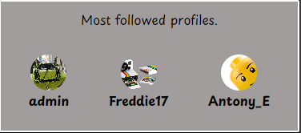
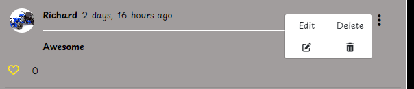
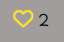

# Brick Connect
## **Site Overview**

Brick Connect is an online community designed with React.js, tailored specifically for LEGO enthusiasts. It serves as a platform where users can engage with each other, share their LEGO creations, insights, and ideas.

Users have the ability to create posts showcasing their LEGO builds and share them with the community. They can also interact with posts by liking them or adding them to their favorites for later reference. Additionally, users can engage in discussions by commenting on posts, allowing for feedback, questions, and conversations within the community.

Brick Connect also provides users with control over their contributions. Post owners can edit or delete their posts as needed, ensuring they maintain ownership and autonomy over their content.

To keep users informed and engaged, Brick Connect includes a notification system. Users receive notifications for comments left on their posts, as well as notifications when others follow them. This feature enhances user interaction and helps maintain a sense of community within Brick Connect.

Overall, Brick Connect offers a welcoming and collaborative environment where LEGO enthusiasts can come together, share their passion, and enjoy the world of LEGO building.

Brick Connect serves as a front-end component which is connected to the [Brick Connect API backend](https://github.com/Antonyeaster/brick-connect-api), developed using Django Rest Framework.

## Table of contents:
1. [**Site Overview**](#site-overview)
1. [**Planning stage**](#planning-stage)
    * [**Strategy**](#strategy)
      * [***Site Aims***](#site-aims)
      * [***Target Audiences***](#target-audiences)
      * [***User Stories***](#user-stories)
    * [***Wireframes***](#wireframes)
    * [***Database Schema***](#database-schema)
    * [***Colour Scheme***](#color-scheme)
    * [***Typography***](#typography)
1. [**Agile Development**](#agile-development)
1. [**Features**](#features)
    * [***Navbar***](#navbar)
    * [***Authentication***](#authentication)
      * [***Sign Up***](#sign-up)
      * [***Sign In***](#sign-in)
      * [***Sign Out***](#sign-out)
    * [***Posts Pages***](#home-page)
    * [***Post Detail***](#post-detail-page)
    * [***Profile Pages***](#Profile-page)
    * [***Notifications Page***](#notifications-page)
    * [***Toasts***](#toasts-messages)
    * [***Defensive Design***](#defensive-design)
    * [***User Authentication***](#user-authentication)
    * [***404 Page***](#404-page)
1. [**Future Enhancements**](#future-enhancements)
1. [**Testing Phase**](#testing-phase)
1. [**Deployment**](#deployment)
1. [**Technologies Used**](#software-and-tech)
1. [**Media**](#media)
1. [**Credits**](#credits)
1. [**Honourable mentions**](#honorable-mentions)
1. [**Disclaimer**](#disclaimer)

## Planning Stage

### **Site Aims:**
* Create an interactive Lego community where users can engage with others and gain inspiration.
* Have a simple, intuitive sign up and sign in section for all users to gain full access.
* Have easy to follow navigation for both mobile and desktop devices.
* Provide CRUD (create, read, update, delete) functionality for posts.
* To give the users different sections for their liked posts and favourited posts.
* Have a search bar enabling the user to search for posts or other users.
* Have profile information for the user to fill out an optional bio about themselves.
* Connect seamlessly with the Brick Connect API back end.
* Give registered users full access to the site, enabling them to create posts, comment on posts, like posts, like comments, favourite posts, and edit all previously listed.
* Giving all users the chance to gain inspiration by being able to view all posts even when unregistered

### **Target Audiences:**
* Lego enthusiasts looking for other Lego enthusiasts
* People wanting to track their Lego journey
* People looking to get into Lego but need inspiration
* People looking for ideas for their next build
* People are just generally interested in Lego.
* Lego creators wanting to share their ideas with others

### **User Stories:**

#### **Site User**
As a **Registered** user I can: 
* Sign in to the site so that I can gain full access to the site
* See if I'm logged in or not so that log in if needed
* View the navbar from all pages so that I can navigate between pages easily
* Navigate through pages quickly and efficiently so that I can view the site content without page refresh
* Maintain my logged in status until I choose to log out so that my user experience is not compromised
* View other users avatar so that I can easily identify that particular profile user
* Create posts so that I can share my images with the rest of the community
* Delete my posts so that remove any posts I don't want to display
* View the post detail so that I can learn more about the post
* Like or remove my like from a post so that I can express my liking of the post or remove the like if I choose to do so
* View the most recent posts ordered by created first from top to bottom so that I can quickly be up to date with all the new posts
* Search for post with keywords or by username so that I can find posts and user profiles I am most interested in
* View posts I've liked so that I can share them with other or just revisit them
* View my favourite posts so that I can separate my general liked posts from my favourites
* Keep scrolling through the posts so that I don't have to keep pressing next page
* Keep scrolling through comments so that I don't have to keep going to the next page
* Click on the posts to view the post page so that I can read the comments about the post
* Edit my post title, description and change the image so that my post can be corrected or updated after it was posted
* Create a comment on a post so that I can share my thoughts about the post
* See how long ago the comments were posted so that I know how long ago the comment was made
* Read all comments on a post so that I can see what other people this of the post
* Delete my comment so that I have removal control over my comments
* Edit the comment so that I can fix or update the comment
* Like a comment so that I can express myself without having to make a comment
* View other profile pages so that I can see information about their posts
* View a list of the most followed profiles so that I can see which profiles are the most popular
* Follow and unfollow so that I can control the specific posts within my feed
* Edit my profile so that I can update my information
* Update my username and password so that update my display name and keep my profile secure
* Sign out of my profile so that I can keep my profile secure
* Favourite a post so that I can come back to them for inspiration
* Receive notifications so that I can get updated when someone follows my profile or has made comment on my post
* Click on delete/sign out and get a pop up so that I can confirm I defiantly want to do these things
* Categorise my post so that other users can fin my posts easier
* See a pop up so that I know I have done something successfully or there was a problem
* Like a comment so that I can express myself without having to make a comment

As an **Unregistered** User I can:
(Some user stories relate to both registered and unregisted, this is why they are duplicated for each section)

* Create a new account so that I can access the full sights features
* View the post detail so that I can learn more about the post
* View the most recent posts ordered by created first from top to bottom so that I can quickly be up to date with all the new posts
* Search for post with keywords or by username so that I can find posts and user profiles I am most interested in
* Click on the posts to view the post page so that I can read the comments about the post
* View other profile pages so that I can see information about their posts
* View a list of the most followed profiles so that I can see which profiles are the most popular 

### **Wireframes**

To give myself a guideline for the project I created wireframes for desktop and mobile.

### Desktop wireframes

### Mobile wireframes

### Wireframe adjustments

During the project I decided to make adjustments to some of the features I'd originally planned to do and the layout.

* Firstly, I decided to not implement popular posts at this stage. I have left this within the wireframes as this will be added to future enhancments.

* I've also decided to move the icons within the post card, this was to make room for the text writted like and comment count.

* I used dropdowns within the navbar to keep the navbar more tidy and less clustered.

### **Database Schema**

I used [dbdiagram](https://dbdiagram.io/home) to help build my database tables. The image below shows the diagram.

### **Colour Scheme:**

A various range of colours have been used and I have used [EightShapes](https://contrast-grid.eightshapes.com/?version=1.1.0&background-colors=&foreground-colors=000%0D%0Aa19d9d%0D%0Affffff%0D%0Afce300%0D%0Ad63e5f%0D%0A%0D%0Aff0000%0D%0A06cdf0&es-color-form__tile-size=compact&es-color-form__show-contrast=aaa&es-color-form__show-contrast=aa&es-color-form__show-contrast=aa18&es-color-form__show-contrast=dnp) to generate the contrast chart.

​

#### **Typography**

I decided to only use one type of font from Google Fonts. The font I chose is [Playpen Sans](https://fonts.google.com/specimen/Playpen+Sans?query=play)

​

## Agile Development

I used Github projects to create and track issues and User Stories. The Agile processes and methodologies can be viewed [here](/AGILE.md)

# Features

## **Site Navigation**

### **Navbar**

The Navbar hold the site together, I have used a React Bootstrap component for the layout. When the user is logged out they will have access to the Home page and Sign in / Sign up pages.

If the user is signed in the Navbar offers more options including, adding a post, Feeds dropdown, Category dropdown, Notifications, Profile and Sign out.

To display the navbar on smaller screens, I used the hamburger menu.

## Authentication

#### Sign Up

To create an account the user must fill in the sign up form, the backend will then handle authentication using dj-rest-auth.

This form will display errors if:

* The user chooses a username that is already taken
* The fields are left blank
* The password do not match
* The password is to easy i.e "password"

Example below

On successfull sign up the user will be redirected to the sign in page with a message to confirm sign up.

#### Sign In

Registered users can fill in the sign in form to sign in.

If the sign in details are incorrect, the user will see an error message.

If sign in is successful the user will receive a pop up message saying welcome.

#### Sign Out

To sign out of the current profile the user can use the sign out link in the navbar to sign out.

This will trigger a confirmation modal and the user has the option to confirm or cancel.

The user will then receive a pop up confirmation that they have been signed out.

#### **Responsiveness**

The sign in and up forms will display slightly different on mobiles.

### **Posts Pages**

#### *All Posts*

All posts are displayed on the Home page, this is a list of all the current users posts.

The posts page also works on mobile devices displaying responsiveness.

Users also have the ability to search for a specific post or profile name

The popular profiles are another large and important part of the home page. This displays the most popular profiles, calculated based on the total number of followers. The profile with the most followers will be at the top. The button on the right displays only on the desktop screen and changes depending on the following status.

On smaller screens, the user will only see three profiles and the follow button will not be displayed. Clicking the user's avatar will take you to the user's profile, this works on both the desktop and mobile versions.

#### *Feed*

The feed page is accessed within the feeds dropdown. This page displays posts by the users you follow, unfollowing a user will remove the posts from the feed page. If a user doesn't follow any other profiles they will see the image below.

#### *Liked Feed*

The liked feed works in the same way but it filters the signed in users liked posts. If the user hasn't liked any posts the above "No results" image will display.

#### *Favourited*

The favourited feed works in the same way but it filters the signed in users favourited posts. If the user hasn't favourited any posts the above "No results" image will display. 

#### *Category*

#### *Full Set Builds*

The full set builds will all be filtered into one page. The posts highlight the category of the post with a pill shapped indication in the top right corner. 

#### *DIY Builds*

The DIY Builds is the same as full set builds but only renders the DIY Builds.

### Post Detail Page

If a user clicks on a post they will be taken to the post detail page.

#### Edit Post

The owner of the post will have a dropdown available to them within the post.

If the user selects edit, they will be taken to a pre-populated post form.

Toast pop ups will confirm when the user has made a post edit or if they deleted the post completely.

The like icon will change visually when a user wants to like a post, and the like count will increase. The comment icon will take the user into the post detail to make a comment. The favourites icon will also change visually when clicked and only display to users that are logged in and don't own the post. If a comment is made, the comment count will increase, and depending on how many comments there are, the wording will change accordingly.

At the bottom of the post will be a comment box for authenticated users. 

Once the comment is submitted a pop up will be displayed.

The comments are all listed below the post and the comment owner has the ability to use the dropdown menu.

Selecting edit will bring up a pre-populated comment form.

When the comment has been edited a pop up will display.

If the user decides to delete the comment another pop up will display.

Authenticated users also have the option to like comments that don't belong to them, the icon will display solid if liked and outlined if not liked by the current user.

The post detail page also work on mobile devices, as seen below.

#### Profile Page

The authenticated users profile can be accessed from the navbar profile name/avatar, posts, comments and popular profiles.

The following feature is also used on the profile page. The follow button changes when the user follows or unfollows another user.

Profile owners will have access to a dropdown featuring the below options.

Users have the option to edit their profile.

Once the user has successfull edited their profile and click save, they will be redirected back to their profile page.

Users can also update their username.

Users can also update their password.

Each one of these changes will trigger a toast if submitted successfully.

### Notifications Page

The notifications page can be accessed from the Navbar if the user is authenticated.

The notifications display in list form with the most recent at the top. With each notification having a time/date received.

Notifications can be marked as read or left unread. If unread, the notification will have a red dot in the top left corner. Once marked as read, the red dot will disappear. Also the button will change depending on the status.

The delete button will trigger a modal to confirm the deletion. 

If the notification is regarding a comment that has been made, the signed in user will have a button to take them directly to the post the comment was made on.

#### **Infinite scroll**

The infinite scroll feature is present in the post list, comment list, and notification list. This creates a smoother experience for the user and prevents the need to keep going to the next page.

### Components

Several components are reused throughout the project:

* Asset.js is used to hold the Spinner. The spinner is used across the whole site as a loading spinner.

* Avatar.js has been used, in profiles, posts, comment, notifications, navbar.

* EditDeleteDropdown.js used to allow users to toggle a dropdown for editing in posts, profile and comments.

* ModalConfirmation.js is used to render all modals for defensive design.

* Navbar.js to give the user an easy way to navigate the site.

* NotFound.js to display a 404 error page.

## Toasts

The user will be given feedback for certain interaction with the site. These include:

* Successful sign up
* Successful sign in
* Successful sign out
* Successful post, edit and delete
* Successful comment, edit and delete
* Successful notification delete
* Successful profile edit

If any of these functions fail an error toast will be displayed. 

## Defensive Design

Modals have been used to control defensive design user deletion/sign out.

### **User Authentication**

The useRedirect hook has been used to prevent unauthenticated users from getting access to features that users should be authenticated for. This has been set up so that if a user types in a URL that is related to an authenticated area, they will be redirected away from it.

### **404 Page**

The 404 custom page has been created to catch any unknown or misstyped URLs, or if there was an issue with a particular piece of content and it's no longer there.

## Future Enhancements

There are quite a few future enhancements I'd like to feature in a later development of this site. However, due to the nature of the course and having a deadline coming up quickly, it was more sensible to make note of these and come back to them.

Enhancements include:

* Posting videos (timelapse of peoples builds)

* A more refined notification system - Meaning the user to provide their email on sign up and get email notifications

* Notification indication from the navbar

* Direct profile link to the user that just followed you

* A sharing system, so users can share a post they really like with other users

* Popular Posts - to show what posts are trending at the current time

## Testing Phase

The testing process, along with bugs, can be viewed [here](/TESTING.md)​

## Deployment

The Deployment is detailed in a separate file. It can be found [here](/DEPLOYMENT.md)

The Brick Connect API can be found [here](https://github.com/Antonyeaster/brick-connect-api) 

## Technologies Used

### Languages

* HTML
* CSS
* JavaScript

### Framework, Libraries and Tools

* [React Bootstrap](https://react-bootstrap-v4.netlify.app/) to use key components
* [Cloudinary](https://cloudinary.com/) to handle static images
* [dbdiagrams](https://dbdiagram.io/home) to create the logic for the project
* [dj-rest-auth](https://dj-rest-auth.readthedocs.io/en/latest/) to control user authentication
* [Am I Responsive](https://ui.dev/amiresponsive) to check for responsiveness
* [Chrome Developer Tools](https://developer.chrome.com/docs/devtools/) to help develop the site and debug when needed
* [Django Rest Framework](https://www.django-rest-framework.org/) to use as a python framework for developing the backend API
* [Google Fonts](https://fonts.google.com/) to find and use my chosen font
* [Font Awesome](https://fontawesome.com/) to provide all icons used across the site
* [ElephantSQL](https://www.elephantsql.com/) to handle postgreSQL database
* [Eightshapes](https://contrast-grid.eightshapes.com/?version=1.1.0&background-colors=&foreground-colors=000%0D%0Aa19d9d%0D%0Affffff%0D%0Afce300%0D%0Ad63e5f%0D%0A%0D%0Aff0000%0D%0A06cdf0&es-color-form__tile-size=compact&es-color-form__show-contrast=aaa&es-color-form__show-contrast=aa&es-color-form__show-contrast=aa18&es-color-form__show-contrast=dnp) for colour contrast help
* [Heroku](https://www.heroku.com/) For project deployment
* [JSX](https://legacy.reactjs.org/docs/introducing-jsx.html) to implement JavaScript logic with HTML
* [React Hot Toast](https://react-hot-toast.com/) to handle toasts pop up notifications
* [ReactJS](https://react.dev/)To build components that you can put together to build a front end application
* [React Router](https://v5.reactrouter.com/web/guides/quick-start) for dynamic routing
* [React Infinite Scroll](https://www.npmjs.com/package/react-infinite-scroll-component) for infinite scrolling on the comments, posts, and notifications
* [Gitpod](https://www.gitpod.io/) to create, load and push my code to GitHub
* [GitHub](https://github.com/home?ef_id=_k_Cj0KCQjwqpSwBhClARIsADlZ_Tm8cXuoED2r24fakY1kqXeptQcrc2ncHiUqOaa_vuLGhA6w5nZTWXUaAr6CEALw_wcB_k_&OCID=AIDcmm153qff2f_SEM__k_Cj0KCQjwqpSwBhClARIsADlZ_Tm8cXuoED2r24fakY1kqXeptQcrc2ncHiUqOaa_vuLGhA6w5nZTWXUaAr6CEALw_wcB_k_&gad_source=1&gclid=Cj0KCQjwqpSwBhClARIsADlZ_Tm8cXuoED2r24fakY1kqXeptQcrc2ncHiUqOaa_vuLGhA6w5nZTWXUaAr6CEALw_wcB) to create and store my repository for this project
* [Favicon] to 
* Git - for version control
* CSS - for custom styling in conjunction to Bootstrap
* HTML - for small amounts of HTML across the site
* JavaScript - to develop all logic used on the frontend

## Media

### Post Images

Images uploaded by other users are out of my control and I am unable to reference them here.

Post images that I've made while using images from google:

* [Lego go kart](https://theplasticbrick.com/shop/item/go-kart-lego-set-948-1)
* [Lego flip flop](https://www.google.com/url?sa=i&url=https%3A%2F%2Fltiads.in%2Fperuse.php%3Fcname%3Dlego%2Bflip%2Bflops%26cid%3D44&psig=AOvVaw3jWwfqpV7VYHU9-yFKtqBs&ust=1709712689719000&source=images&cd=vfe&opi=89978449&ved=0CBMQjRxqFwoTCPDulaPW3IQDFQAAAAAdAAAAABAI)
* [Lego sunbathing](https://www.xialod.top/products.aspx?cname=lego+set+60153&cid=79)
* [Lego mini figures](https://theminifigclub.com/wp-content/uploads/2019/09/20-random-oto-closeup-1024x683.jpg) located on sign in and sign up page
* [Lego tractor](https://asda.scene7.com/is/image/Asda/5702016889727_video?hei=1026&wid=762&qlt=85&fmt=pjpg&resmode=sharp2&op_usm=1.1,0.5,0,0&defaultimage=default_details_George_rd)
* [Lego Head](https://www.google.com/url?sa=i&url=https%3A%2F%2Fwww.istockphoto.com%2Fphoto%2Flego-head-close-up-gm472620728-64253595&psig=AOvVaw1zL8PeHq0mOvq6hs9c3vTC&ust=1711753114886000&source=images&cd=vfe&opi=89978449&ved=0CBIQjRxqFwoTCJj3n7eHmIUDFQAAAAAdAAAAABAF)
* [Lego Polaroid](https://www.google.com/url?sa=i&url=https%3A%2F%2Fwww.lego.com%2Fen-gb%2Fproduct%2Fpolaroid-onestep-sx-70-camera-21345&psig=AOvVaw2Qhw3-hA9_k4COBsjrUewl&ust=1711753306035000&source=images&cd=vfe&opi=89978449&ved=0CBIQjRxqFwoTCMiKrZCImIUDFQAAAAAdAAAAABAD)

### Icons

The Brick connect Icon was created on [Flat Icon](https://www.flaticon.com/) credit for this Icon goes to [**Freepik**](https://www.flaticon.com/authors/freepik)

The upload and not found icons were also created on [Flat Icon](https://www.flaticon.com/)credit for these Icons also goes to [**Freepik**](https://www.flaticon.com/authors/freepik)

## Credits

* The moments walk through supplied by Code Institute was followed for inspiration and reference during the process of this project.

### Code Help

* For help with 'naturaltime' in my serializers I used this [Stackoverflow](https://stackoverflow.com/questions/70952799/how-to-use-django-contrib-humanize-filter-in-drf-serializers)

* For help with testing in react with findbyrole in particular I used [Stackoverflow](https://stackoverflow.com/questions/74979453/testing-for-existence-of-react-modal-using-react-testing-library-with-findbyrole)

* For help with eslint display name while testing [Github](https://github.com/jsx-eslint/eslint-plugin-react/blob/master/docs/rules/display-name.md)

* For general help across the whole frontend part of the project [ReactJS](https://react.dev/)

* [Django Rest Framework](https://www.django-rest-framework.org/) This was too used across the build of the backend API

Other sources include:

* Code Institute LMS
* [React Bootstrap Documentation](https://react-bootstrap.netlify.app/)
* [Geek for Geeks](https://www.geeksforgeeks.org/)

## Honourable mentions

* A huge thank you to my mentor, Richard Wells. Richard's been brilliant at giving help and feedback as well as keeping a calm head on the whole project.
* The community on the Code Institute Slack channel has always generally come across the same problems at some point, and someone is always around to lend a helping hand.
* The tutor support team at Code Institute has been a huge help with any particular problems I've come across.
* A general thanks to my family and friends who have always been patient with me when I need a quiet place to work.

## Disclaimer

* This project has been made for educational reasons. Any of the post images used have not been claimed as my own and have been referenced above.
